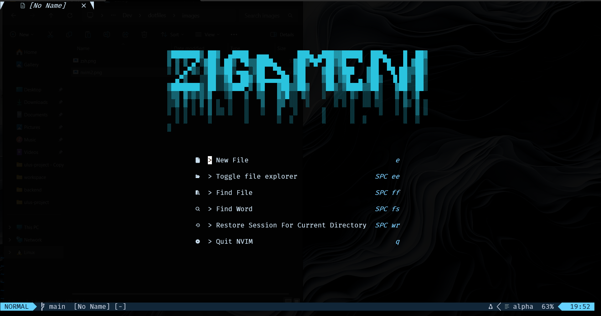
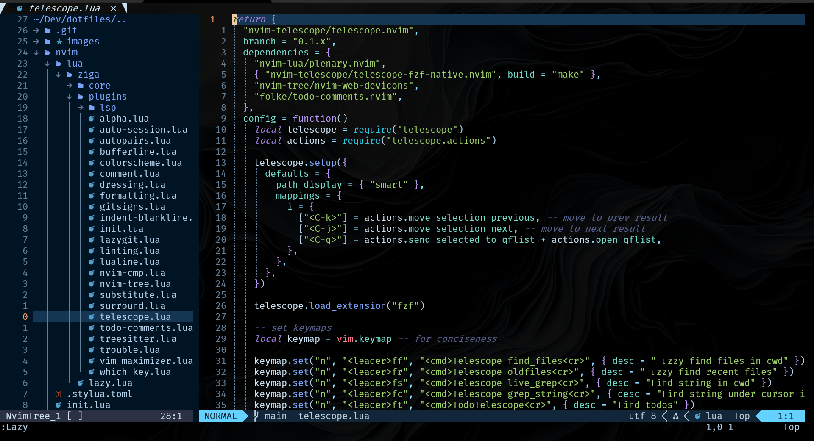
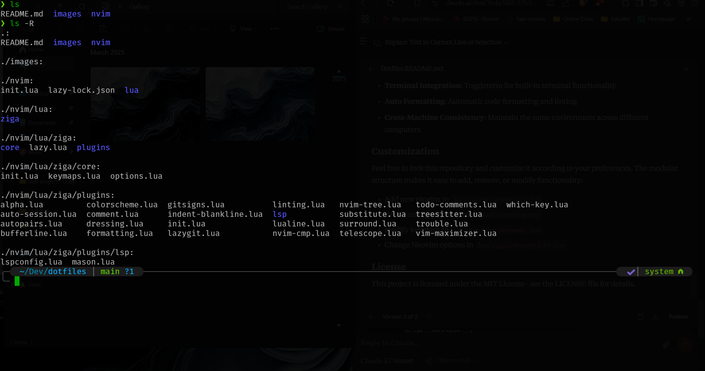

# My Dotfiles

This repository contains my personal dotfiles for maintaining a consistent development environment across different machines.

## Table of Contents

- [Overview](#overview)
- [Components](#components)
  - [Neovim](#neovim)
  - [Zsh](#zsh)
- [Installation](#installation)
- [Screenshots](#screenshots)
- [File Structure](#file-structure)
- [Key Features](#key-features)

## Overview

These dotfiles represent my customized development environment, focused on productivity and a pleasant user experience. The configuration includes my Neovim setup and Zsh shell customizations.

## Components

### Neovim

My Neovim configuration includes:

- Modern UI with custom colorscheme
- Lazy.nvim for plugin management
- Alpha dashboard for a clean startup screen
- File explorer with nvim-tree
- Git integration with gitsigns and lazygit
- LSP support with automatic formatting and linting
- Syntax highlighting with Treesitter
- Telescope for fuzzy finding
- Terminal integration with toggleterm
- Tab management with bufferline
- Custom keymaps for productivity
- Auto-session management
- And more productivity enhancements

### Zsh

My Zsh configuration features:

- Custom prompt with git status integration
- Useful aliases for common commands
- Enhanced history management
- Tab completion improvements
- Directory navigation shortcuts

## Installation

1. Clone this repository:

   ```bash
   git clone https://github.com/yourusername/dotfiles.git ~/.dotfiles
   ```

2. Create symbolic links:

   ```bash
   # For Neovim
   ln -s ~/.dotfiles/nvim ~/.config/nvim

   # For Zsh
   ln -s ~/.dotfiles/.zshrc ~/.zshrc
   ```

3. Install requirements:

   ```bash
   # Neovim (version 0.8.0 or later recommended)
   # Lazy.nvim will automatically install plugins on first launch

   # For LSP features, ensure you have:
   # - ripgrep
   # - fd
   # - A Nerd Font installed and configured in your terminal
   ```

4. Restart your terminal and launch Neovim to apply changes.

## Screenshots

### Neovim





### Zsh Terminal


_Zsh terminal with custom prompt and command highlighting_

## File Structure

```
nvim/
├── init.lua                  # Main entry point
├── lazy-lock.json           # Plugin version lock file
└── lua/
    └── ziga/                # Configuration namespace
        ├── core/            # Core configurations
        │   ├── custom.lua   # Custom user settings
        │   ├── init.lua     # Core initialization
        │   ├── keymaps.lua  # Key mappings
        │   └── options.lua  # Neovim options
        ├── lazy.lua         # Lazy.nvim setup
        └── plugins/         # Plugin configurations
            ├── lsp/         # LSP configurations
            │   ├── lspconfig.lua
            │   └── mason.lua
            ├── init.lua     # Plugin specification
            ├── alpha.lua    # Dashboard configuration
            ├── telescope.lua
            ├── treesitter.lua
            └── [other plugin configs]
```

## Key Features

- **Plugin Management**: Uses lazy.nvim for efficient plugin loading
- **LSP Integration**: Configured with Mason for easy language server management
- **Git Integration**: Gitsigns for inline git information and Lazygit for terminal UI
- **Fuzzy Finding**: Telescope for files, buffers, and more
- **Custom Search and Replace**: Use substitute.nvim for enhanced search/replace
- **Aesthetics**: Custom colorscheme and lualine status bar
- **Window Management**: Intuitive keybindings for managing split windows and tabs
- **Terminal Integration**: Toggleterm for built-in terminal functionality
- **Auto Formatting**: Automatic code formatting and linting
- **Cross-Machine Consistency**: Maintain the same environment across different computers

## Customization

Feel free to fork this repository and customize it according to your preferences. The modular structure makes it easy to add, remove, or modify functionality:

- Create configuration files in `lua/ziga/plugins/`
- Modify keymaps in `lua/ziga/core/keymaps.lua`
- Change Neovim options in `lua/ziga/core/options.lua`

## License

This project is licensed under the MIT License - see the LICENSE file for details.
